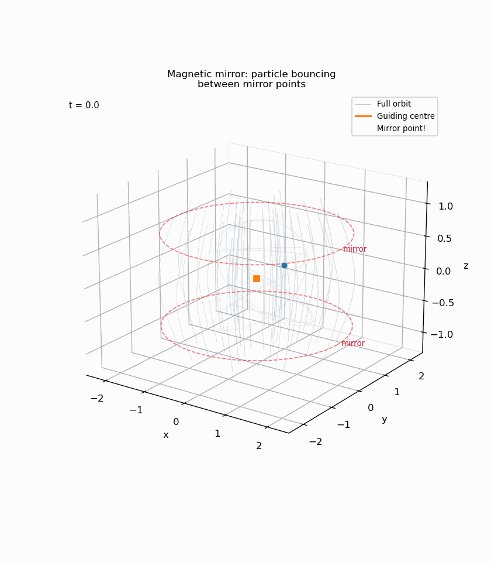

# Particle Orbit Theory

BSc Honours project — The motion of charged particle orbits in electromagnetic fields.

The Lorentz force equation is integrated numerically using `scipy.integrate.solve_ivp` (RK45) and the results are compared against analytic predictions from guiding-centre theory. The project covers everything from basic gyromotion in a uniform field up to a rotating tilted dipole representing a planetary magnetosphere.

Written for MT4599, University of St Andrews.

## What's in the repo

```
Applications/       Python scripts and core modules (run from here)
  orbit_ivp_core.py   Lorentz force solver + guiding-centre extraction
  fields.py           Field library (uniform, gradient, dipole, rotating dipole, ...)
  guiding_centre.py   Guiding-centre equations of motion
  test01-test16       Test/simulation scripts — see Applications/README.md
  animate*.py         Animation scripts that produce GIFs

Figures/             Output figures and animations (PNGs regenerated by scripts, GIFs tracked)
Report/              LaTeX dissertation source
Presentation/        Project presentation (.pptx)
Results/             Validation data and summary
```

## Test scripts

| Script | What it does |
|--------|-------------|
| test01 | Circular gyromotion in uniform B |
| test02 | Helical motion (parallel + perpendicular velocity) |
| test03 | E x B drift |
| test04 | Gradient-B drift |
| test05 | Magnetic mirror bounce |
| test06 | Analytic bounce periods (bounce integral) |
| test07 | Dipole field sanity checks |
| test08 | Full orbit in dipole field — gyration, bounce, drift |
| test09 | Curvature drift |
| test10 | Bounce period: numerical vs analytic |
| test11 | Full orbit vs guiding-centre approximation |
| test12 | Dipole field line diagram |
| test13 | 10 keV electron at L=3 in Earth's field (SI units) |
| test14 | Tilted dipole — Neptune (47 deg) and Uranus (59 deg) |
| test15 | Corotation E x B drift |
| test16 | Rotating tilted dipole — full planetary magnetosphere |

## Setup

```bash
pip install numpy scipy matplotlib seaborn
```

Python 3.10+ recommended.

## Running

All scripts run from inside `Applications/`:

```bash
cd Applications
python test01_uniformB_xy_orbit.py
```

Figures are saved to `../Figures/`. The directory must exist — create it with `mkdir ../Figures` if needed. PNG figures are not tracked in git (regenerate by running the scripts); GIF animations are tracked.

## Sample output

Some of the animations produced by the scripts:

**Helical motion in a uniform field** (test02)


**Magnetic mirror bounce** (test05)



**Full orbit in dipole field** (test08)


**Rotating tilted dipole — Neptune-like magnetosphere** (test16)


## Validation

Key results from the test suite (see `Results/validation_summary.md` for details):

- E x B drift speed matches theory exactly (0.00% error)
- Gradient-B drift within 3% of analytic formula
- Bounce period within 1% of analytic prediction
- Mirror latitude in SI case accurate to 0.02%
- Corotation recovery: 96.6% of input rotation rate

## References

- Baumjohann & Treumann, *Basic Space Plasma Physics* (1996)
- Boyd & Sanderson, *The Physics of Plasmas* (2003)
- Jackson, *Classical Electrodynamics* (3rd ed., 1999)
